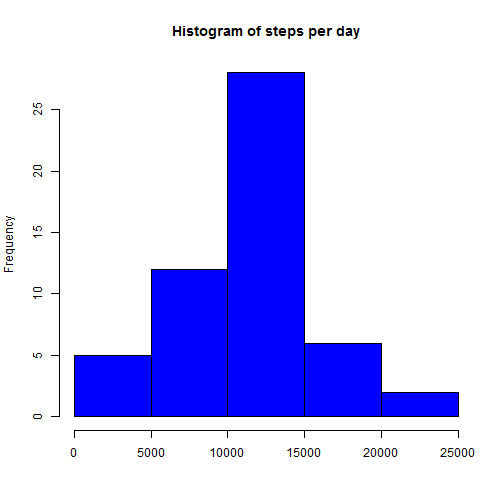
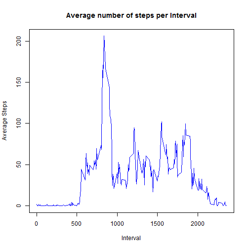
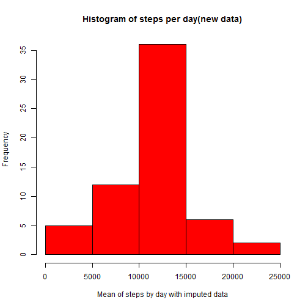
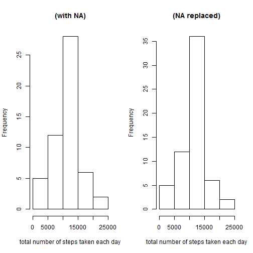
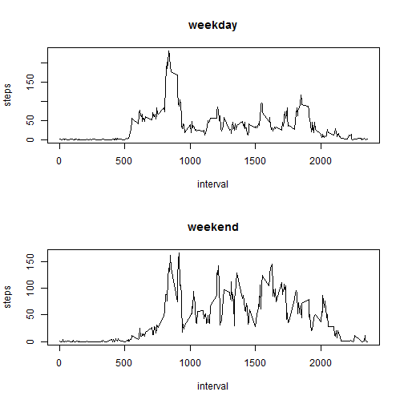

## 0. Load dataset

```r
ds_activity       <-      read.csv("activity.csv", header=TRUE, sep = ",")
```

## 1. What is mean total number of steps taken per day?
### 1.1. Calculate the total number of steps taken per day

```r
ds_activity_agg  <- aggregate(steps~date,data=ds_activity,FUN=sum, na.rm=TRUE) 
```

### 1.2. Make a histogram of the total number of steps taken each day

```r
hist(ds_activity_agg$steps, main="Histogram of steps per day", col="blue", xlab="")
```

 

### 1.3. Calculate and report the mean and median of the total number of steps taken per day

```r
ds_activity_mean    <- as.integer(mean(ds_activity_agg$steps, na.rm=TRUE))
ds_activity_median  <- as.integer(median(ds_activity_agg$steps, na.rm=TRUE))
```
The calculated mean is 10766 and median is 10765. 


## 2. What is the average daily activity pattern?


```r
ds_activity_steps_mean  <-   aggregate(steps~interval,data=ds_activity,FUN=mean, na.rm=TRUE) 
plot(ds_activity_steps_mean$interval, ds_activity_steps_mean$steps, main="Average number of steps per Interval", col="blue", xlab="Interval", ylab="Average Steps", type="l")
```

 


```r
maxim <- ds_activity_steps_mean$interval[ds_activity_steps_mean$steps==max(ds_activity_steps_mean$steps)]
```

The 5-min interval that contains the maximum number of steps is 835. 


## 3. Imputing missing values

### 3.1. Total number of missing values in the dataset 


```r
nas_values <- sum(is.na(ds_activity[,1]))
```

The dataset have 2304 missing values.


### 3.2. Filling in all of the missing values in the dataset -> Create a new dataset with the missing data filled in

The strategy selected to fill NA values in the dataset is: the missing values are filled with the average steps for that day. 


```r
ds_activity_updated <- ds_activity
for (i in 1:nrow(ds_activity_updated)){
        if (is.na(ds_activity_updated[i,1])) {
                ds_activity_updated[i,1] <- ds_activity_steps_mean$steps[ds_activity_steps_mean$interval==ds_activity_updated[i,3]]
        }
}
```


### 3.3.Histogram of the total number of steps taken each day and  report the mean and median total number of steps taken per day. 


```r
ds_activity_agg_update <- aggregate(steps~date, ds_activity_updated, sum)

ds_activity_new_mean   <- as.integer(mean(ds_activity_agg_update$steps))

ds_activity_new_median <- as.integer(median(ds_activity_agg_update$steps))

hist(ds_activity_agg_update$steps, xlab='Mean of steps by day with imputed data',  main="Histogram of steps per day(new data)", col="red")
```

 

The previous values for the mean and median where 10766 and  10765, and after the information update the values the mean is 10766 and median change to  10766.


```r
par(mfrow = c(1, 2))

hist(ds_activity_agg$steps, main = "(with NA)", xlab = "total number of steps taken each day")

hist(ds_activity_agg_update$steps, main = "(NA replaced)", xlab = "total number of steps taken each day")
```

 

The histogram comparation shows a similar shape between  both histograms, the new one(with no NAs) have a small increase in the frequency due to the input of the new data based in the days average.

## 4. Are there differences in activity patterns between weekdays and weekends?


```r
ds_activity_updated$date <- strptime(ds_activity_updated$date, '%Y-%m-%d')
ds_activity_updated$date <- weekdays(ds_activity_updated$date)


ds_weekend <- ds_activity_updated[ds_activity_updated$date %in% c('sábado', 'domingo'),]
ds_non_weekend <- ds_activity_updated[!(ds_activity_updated$date %in% c('sábado', 'domingo')),]


ds_weekend_final <- aggregate(steps ~ interval, ds_weekend, mean, na.rm=T)
ds_non_weekend_final <- aggregate(steps ~ interval, ds_non_weekend, mean, na.rm=T)


par(mfrow=c(2,1))
plot(ds_non_weekend_final, type="l", main="weekday")
plot(ds_weekend_final, type="l", main="weekend")
```

 
